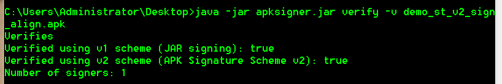

## ApkSignTool ##

### 一、前言 ###
ApkSignTool可以用于对APK进行重新签名和对齐操作（包括V1、V2签名）。

### 二、实现思路 ###

通过对jarsigner、apksigner和zipalign进行封装调用，实现对APK的二次签名和对齐。

工具界面通过Java的Swing桌面控件来实现。

部分代码如下：

**V1签名：**

	// 对APP包进行签名的CMD命令
	public static String CMD_SIGN_PACKAGE = "cmd.exe /C jarsigner -digestalg SHA1 -sigalg MD5withRSA " + TSA
			+ " -verbose -keystore " + "%s" + " -signedjar %s %s " + "%s" + " -storepass "
			+ "%s";
			
**V2签名：**

	// 对APP包进行签名的CMD命令
	public static String CMD_SIGN_V2_PACKAGE = "cmd.exe /C java -jar " + "%sapksigner.jar sign --ks "
			+ "%s" + " --ks-key-alias " + "%s" + " --ks-pass pass:" + "%s" + " --out %s %s";
			
**压缩对齐：**

	// 对APP包进行压缩对齐的CMD命令
	public static String CMD_ZIPALIGN_PACKAGE = "cmd.exe /C " + "%szipalign -v 4 %s %s";

**主窗体界面：**

    setTitle("安卓APK二次签名工具" + "_" + AConstant.VERSION);
    setIconImage(Toolkit.getDefaultToolkit().getImage("res" + File.separator + "icon_p.png"));
    setDefaultCloseOperation(JFrame.EXIT_ON_CLOSE);
    setBounds(100, 100, 511, 583);
    
    Toolkit tk = this.getToolkit(); // 得到窗口工具条
    Dimension dm = tk.getScreenSize();
    setLocation((int) (dm.getWidth() - 511) / 2, (int) (dm.getHeight() - 583) / 2);// 显示在屏幕中央
    setResizable(false);
    getContentPane().setLayout(null);
    
    contentPane = new JPanel();
    contentPane.setBorder(new EmptyBorder(5, 5, 5, 5));
    setContentPane(contentPane);
    contentPane.setLayout(null);
    
    apkPathJPanal = new ApkPathJPanal();
    contentPane.add(apkPathJPanal.getApkPathContentComponent());
    
    keyStoreJPanel = new KeyStoreJPanel();
    contentPane.add(keyStoreJPanel.getContentJComponent());
    
    signLogJPanel = new SignLogJPanel();
    contentPane.add(signLogJPanel.getContentComponent());
    
    btnSign = new JButton("开始签名");
    btnSign.setFont(new Font("宋体", Font.PLAIN, 14));
    btnSign.setBounds(196, 507, 98, 37);
    getContentPane().add(btnSign);
    
    btnSign.addActionListener(signActionListener);

### 三、签名效果 ###

**签名完成：**

**签名检查：**

### 四、运行环境 ###

签名工具目前只支持Windows系统，其他系统可以根据Java特性进行编译修改。

> release中包含同个版本的两个工具

- 添加了JRE环境（如果本地没有安装JRE环境的可以直接下载使用）
- 没有添加JRE环境（需要本地安装JRE环境后使用）

### 五、写在最后 ###

以上就是ApkSignTool的主要内容，后续笔者将会添加新的工具（比如一键生成游戏web链接apk包）

使用中如果遇到问题可以直接联系笔者，QQ：2186087952

希望大家多多交流！！！

